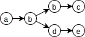

Minimal Indented Tree Notation

Basically, 
```
a b
  c d
  e f
```
represents the graph



This is a different from both [OGDL](https://ogdl.org) and [I-expressions](https://srfi.schemers.org/srfi-49/srfi-49.html):

|  |mitn  | OGDL | I-expression |
|--|------|------|--------|
| S-expression | `(a (b (c (d)) (e (f))))` | `(a (b) (c (d)) (e (f)))` | `(a b (c d) (e f))` |

No definite interpretation of this graph is specified, but one can, for example, interpret leaf nodes as scalar values and the rest as keys in a map held as the value of the parent map, ie. making the example above equal to the following JSON:

```{json}
{ "a": { "b": {
  { "c": "d" },
  { "e": "f" }
}}}
```
