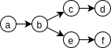

Minimal Indented Tree Notation

Basically, 
```
a b
  c d
  e f
```
represents the graph



This is a different from both [OGDL](https://ogdl.org) and [I-expressions](https://srfi.schemers.org/srfi-49/srfi-49.html):

|  |mitn  | OGDL | I-expression |
|--|------|------|--------|
| S-expression | `(a (b (c (d)) (e (f))))` | `(a (b) (c (d)) (e (f)))` | `(a b (c d) (e f))` |

No definite interpretation of this graph is specified, but one can, for example, interpret leaf nodes as scalar values and the rest as keys in a map held as the value of the parent map, ie. making the example above equal to the following JSON:

```{json}
{ "a": { "b": {
  { "c": "d" },
  { "e": "f" }
}}}
```

## Bonus features

### Quoted node names

To create node names that contain spaces or control codes like newline, tab, etc. then one can use quoted node names, like this:
```
client
  name "Alfred E. Neuman"
  notes "Motto:"A"9""What -
    me worry?"""
```
The corresponding JSON would be
```
{"client": {
    "name": "Alfred E.Neuman",
    "notes": "Motto:\n\t\"What - me worry?\"" }}
```
Quotes begin with `"` and end with `"` followed by a space or a control character. `"` followed by any other character is interpreted as an escape sequence: digits 0-9 and characters A-V/a-v are interpreted as a base 32 nummber in "extended hex" notation. Any other character following `"` is kept as is. Carriage returns are ignores in a quote, and line feeds are replaced with spaces, ignoring any following spaces or tabs. Useful escape sequences include:

| Sequence | JSON sequence | Character |
|----------|--|-----------|
| `"0` | `\u0000` | NUL |
| `"9` | `\t` | TAB |
| `"A` | `\n` | LF / newline |
| `"D` | `\r` | CR / carriage return |
| `""` | `\"` | `"` / double quote |


### Comments

A `#` followed by a space or a tab starts a comment, and everything up until the first following newline is ignored, without affecting indentation:
```
#a#perfectly#valid#nodename# # with a comment after
# and a comment on the next line
  key value
```
Is roughly equivalent to
```
{"#a#perfectly#valid#nodename#": { "key": "value" }}
```

